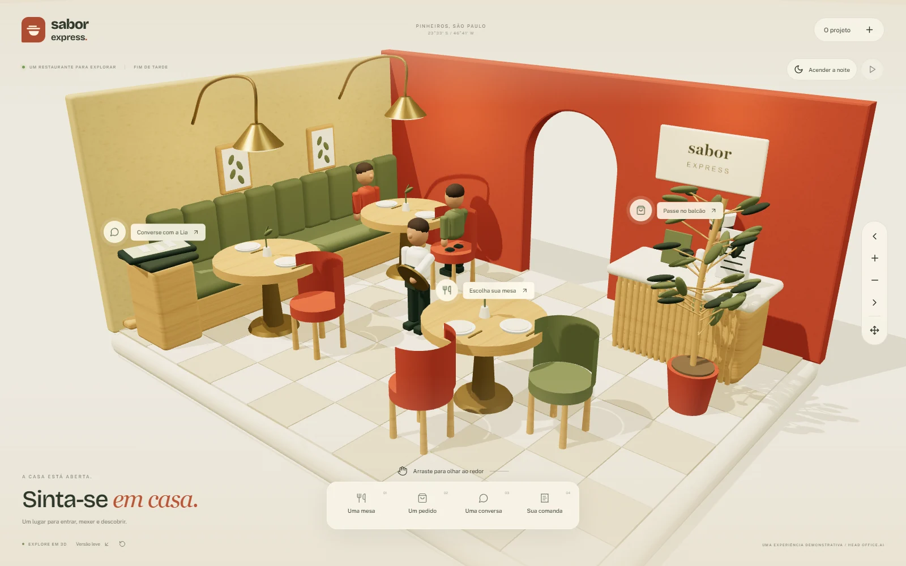
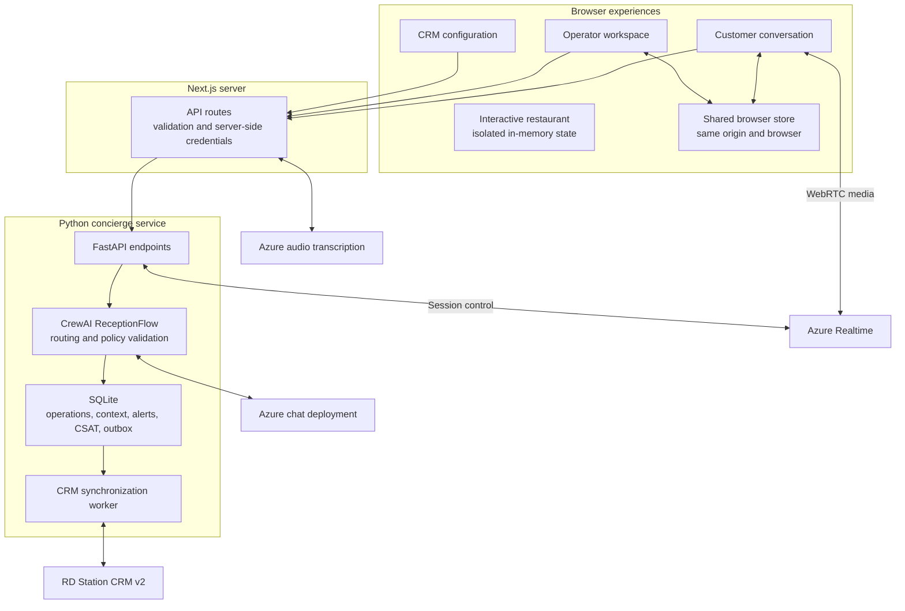

<div align="center">

# Sabor Express

### Thoughtful service. Connected operations. People in control.

A full-stack AI customer-service experience for a fictional restaurant network, combining an immersive 3D environment, conversational operations, human collaboration, voice, and CRM synchronization.


· [Explore the product](#product-experiences) · [Architecture](#system-architecture) · [Run locally](#getting-started) · [Documentation](#documentation)

</div>



## Overview

Sabor Express explores a practical question: **how can AI make restaurant service faster while keeping customer context, operational correctness, and human ownership intact?**

Developed for the **Customer Success & AI Solutions case study at HeadOffice.ai**, the project brings product strategy and implementation into the same experience. A customer can ask for a table, place an order, send a voice message, or request help. An operator can follow the conversation, take over, review AI-generated drafts, and track the resulting operational context.

The implementation is built around four principles:

- **A coherent customer journey.** Conversation, confirmation, handoff, and follow-up share the same context.
- **Application-controlled operations.** Models interpret requests; application code validates prices, availability, consent, and writes.
- **Human ownership.** Operators can intervene, pause automation, and continue without asking the customer to start again.
- **Explicit integration boundaries.** Simulated experiences, local persistence, and real external API calls are identified separately.

The application interface and most operational guides are in **Brazilian Portuguese**. This README provides the English-language entry point for engineering review, setup, and evaluation.

> **Project scope**
>
> This is a functional demonstration and technical case study, not a production restaurant platform. The WhatsApp-inspired interface, restaurant inventory, bookings, delivery fees, and orders are simulated. Configured Azure features call real services, and connecting RD Station CRM can create **real records in the authorized account**. The immersive restaurant at `/` is entirely local and independent of those integrations.

## Contents

- [Product experiences](#product-experiences)
- [Technology stack](#technology-stack)
- [System architecture](#system-architecture)
- [Core processes](#core-processes)
- [Operating modes](#operating-modes)
- [Getting started](#getting-started)
- [Configuration reference](#configuration-reference)
- [API surface](#api-surface)
- [Repository structure](#repository-structure)
- [Engineering practices](#engineering-practices)
- [Testing and verification](#testing-and-verification)
- [Product validation and rollout](#product-validation-and-rollout)
- [Deployment considerations](#deployment-considerations)
- [Documentation](#documentation)
- [Known boundaries](#known-boundaries)

## Product experiences

| Route | Experience | Purpose |
| --- | --- | --- |
| `/` | Interactive restaurant | Explore a full-screen 3D environment and discover the product through direct interaction. |
| `/whatsapp` | Customer conversation | Try messaging, catalog selection, pickup/delivery preferences, reservations, audio, and human handoff. |
| `/dashboard` | Service workspace | Manage conversations, ownership, internal notes, response drafts, satisfaction, and priority alerts. |
| `/crm` | Integration workspace | Authorize RD Station, map locations to pipelines, identify customers, and inspect synchronization. |
| `/apresentacao` | Interactive case presentation | Present the challenge, proposed rollout, demonstration, measurement approach, and English-language pitch. |

### An immersive entry point

The restaurant is a procedural **Three.js** environment, rendered across the viewport rather than inside a conventional marketing section. Visitors can rotate the camera, zoom, select objects, change table capacity, simulate a reservation, follow a combo being prepared, and call a member of staff.

Articulated characters, coffee steam, and a day-to-night lighting transition give the space a sense of activity. HTML controls are projected onto the scene, while a persistent navigation dock provides equivalent actions for keyboard and touch users.

The renderer supports reduced motion, pause/resume, adaptive quality, and recovery from WebGL context loss. An optimized local image provides the loading and illustrated fallback experience. Its state is intentionally isolated: interacting with the restaurant does not create orders in the concierge service or records in the CRM.

### A shared customer and operator journey

The customer experience and inbox show two perspectives of the same browser-based conversation. The workspace provides search, location and ownership filters, internal notes, resolution/reopening, and explicit control over automation.

Manual AI assistance generates three editable response options—empathetic, direct, and next-step oriented. Generating or selecting an option does not send a message. Drafts already being edited are preserved, and stale suggestions are discarded when the conversation changes.

### Voice and service intelligence

- **Audio messages:** record or upload audio, transcribe through Azure, review the text, and send it into the conversation.
- **Live voice:** WebRTC audio with Azure Realtime, with server-controlled turns and the same concierge business logic.
- **Preventive alerts:** analyze text and reviewed transcripts for service-related concerns, preserve evidence, and escalate when appropriate.
- **CSAT:** request a 1–5 satisfaction score after service, persist responses, and expose session metrics and CRM synchronization state.

### A presentation-ready case study

The seven-slide presentation combines implementation with diagnosis, stakeholder adoption, pilot design, and measurement. It includes presenter notes, keyboard navigation, media playback, enlarged product captures, and an English-language closing pitch.

## Technology stack

| Layer | Technologies | Responsibility |
| --- | --- | --- |
| Web application | Next.js 16, App Router, React 19 | Server-rendered entry points, interactive interfaces, and server-side API routes. |
| Language and contracts | TypeScript, Zod | Typed UI state and runtime validation at public API boundaries. |
| Visual system | CSS Modules, shared CSS tokens, Lucide React | Responsive layouts, contextual controls, accessible interaction states, and consistent branding. |
| Immersive rendering | Three.js, OrbitControls, GSAP | Procedural geometry, camera interaction, lighting, animation, and object picking. |
| Service runtime | Python 3.12–3.13, FastAPI, Uvicorn | Concierge endpoints, operational persistence, voice control, and background CRM processing. |
| AI orchestration | CrewAI Flows, Pydantic | Structured intent routing and specialist responses with application-level validation. |
| Model access | Azure AI Foundry, Azure AI Inference SDK, Azure OpenAI-compatible v1 API | Configurable chat inference and structured model responses. |
| Audio transport | Browser media APIs, WebRTC, WebSockets, Azure audio services | Voice-message transcription and server-coordinated live conversations. |
| Persistence | SQLite, browser `localStorage`, IndexedDB | Operational state, durable integration events, local conversation history, and audio blobs. |
| CRM integration | RD Station CRM v2, OAuth 2.0, HTTPX, Cryptography | Account authorization, encrypted credentials, customer/deal synchronization, notes, and tasks. |
| Verification | Node test runner through `tsx`, Python `unittest`, Playwright, ESLint | Contract, domain, integration-adapter, browser, and static checks. |

JavaScript dependencies are resolved in [`package-lock.json`](package-lock.json). Python requirements are declared in [`services/concierge/pyproject.toml`](services/concierge/pyproject.toml), including the pinned CrewAI version. Model deployment names are configuration values, not hard-coded assumptions about a particular Azure subscription.

## System architecture



### Why separate Next.js and Python?

Next.js owns the product interfaces and the browser-facing API boundary. Python hosts the CrewAI runtime, transactional demonstration systems, long-lived voice control, and CRM worker. This keeps model and integration credentials on the server and avoids attempting to run the Python orchestration stack in the browser or Node.js runtime.

### State ownership

| State | Storage | Boundary |
| --- | --- | --- |
| Interactive restaurant visit | React memory | Independent of the operational application; reset by restarting the visit or reloading. |
| Conversation history and browser workspace | `localStorage` and `storage` events | Synchronizes tabs in the same browser and origin; not a distributed messaging backend. |
| Recorded/uploaded audio blobs | IndexedDB | Local to the browser; separate from the textual transcript. |
| Quotes, confirmations, inventory, bookings, profiles, alerts, and CSAT | SQLite | Server-side source for persisted operational decisions. |
| CRM mappings, remote links, and synchronization events | SQLite | Survives process restarts and supports reconciliation. |
| CRM credentials | Encrypted database values and a local key file | Server-side only; database and key must be preserved together. |
| Active voice sessions and local call capabilities | Python process memory | Bound to the running concierge instance. |

Clearing the browser conversation does not restore stock, cancel an existing booking, remove remote CRM records, or erase persisted service alerts.

## Core processes

### 1. From message to confirmed operation

The following transaction flow applies to the configured concierge mode:

1. **Validate the request.** The Next.js route checks the request contract and conversation state before forwarding it.
2. **Check service priority.** Explicit requests for a person and qualifying priority alerts can interrupt automation before business processing.
3. **Understand intent.** Lia routes the request to orders, reservations, birthdays, location information, clarification, or the human team.
4. **Collect only what is missing.** Specialists use validated context and request the next relevant detail. Portuguese numbers, relative dates, and times are normalized by application code.
5. **Prepare a verifiable summary.** Catalog values and simulated availability come from the application, not free-form model claims.
6. **Bind consent to that summary.** Confirmation must refer to the server-held pending summary. Changes invalidate the previous confirmation context.
7. **Revalidate and commit.** Availability, quantity, pricing, and stock are checked again inside the operational transaction.
8. **Record the integration event.** The operation and CRM outbox event are committed together, allowing the customer flow to complete independently of remote CRM availability.

Repeated confirmation requests reuse the existing operational result rather than create another booking or decrement stock twice.

### 2. Human handoff

An operator can take ownership of a conversation, which pauses automated replies for that conversation. The inbox retains the customer history, relevant operational details, and priority context. Internal notes remain separate from customer-visible messages and are excluded from model context.

Late AI responses are checked against the current conversation state so that an old response is not applied after a new message, resolution, or human takeover. During a live AI call, takeover ends the AI voice interaction; the human continuation is through the demonstration chat.

### 3. CRM synchronization and reconciliation

The worker reads durable outbox events and resolves the customer, location mapping, remote deal, and associated notes or tasks. Confirmed orders and bookings have distinct deal records, even when they belong to the same conversation.

The integration distinguishes several outcomes:

| Outcome | Meaning | Operational response |
| --- | --- | --- |
| Pending/retryable | A dependency or temporary API failure prevents delivery. | Retry according to the worker's retry policy and provider guidance. |
| Action required | Identity, permissions, mapping, authorization, or data need attention. | Correct the issue in the appropriate application or CRM workflow. |
| Uncertain remote write | A request may have succeeded, but its outcome was not conclusively received. | Inspect and reconcile before reprocessing. |
| Synchronized | The adapter has confirmed the remote result. | Follow the linked CRM record. |

Deterministic local event IDs, stored remote links, operation codes, and note markers support idempotency and recovery. This is **not a claim of distributed exactly-once delivery** across the remote API.

### 4. Voice uses the same operational rules

For voice messages, the browser uploads audio through the Next.js transcription route, and the reviewed transcript enters the normal conversation flow.

For live voice, the browser carries audio over WebRTC to Azure Realtime. The server handles session negotiation and a control WebSocket, receives final transcripts, executes the concierge flow, and authorizes the resulting voice response. Business operations are initiated by server code rather than unrestricted model tool calls.

### 5. Follow-up closes the loop

The service can issue a CSAT request when a conversation is finalized. Responses are persisted and queued for CRM synchronization. Preventive sentiment alerts are also persisted, with acknowledgement and resolution handled as explicit operations. A customer's preference for a human is treated separately from inferred dissatisfaction.

## Operating modes

| Mode or feature | Required services | External credentials | Behavior |
| --- | --- | --- | --- |
| Restaurant and presentation preview | Next.js | None | Explore the 3D scene, presentation, and application interfaces. |
| Deterministic messaging | Next.js + Python | None for rule-based responses | `ASSISTANT_PROVIDER=demo`; automatic replies use local rules. Python is still required for the preventive monitor and persistence. |
| AI concierge | Next.js + Python + Azure | Azure endpoint, key, and chat deployment | `ASSISTANT_PROVIDER=crewai`; structured model routing plus the transactional demonstration systems. |
| Manual response suggestions | Next.js + Python + Azure | Chat deployment configuration | Uses Azure even if automatic replies are in demo mode. |
| Audio-message transcription | Next.js + Azure | Audio deployment configuration | Uses a separate transcription deployment. |
| Live voice | Next.js + Python + Azure Realtime | Chat and Realtime configuration | WebRTC voice with server-controlled business processing. |
| CRM delivery | Next.js + Python + RD Station | CRM application credentials and completed OAuth | Creates real CRM records from eligible persisted events. |

A configured CrewAI failure does not silently switch to deterministic demo replies. It produces a human fallback. Likewise, a failed external feature is not represented as a successful model response or synchronized CRM write.

## Getting started

### Prerequisites

- **Node.js 20.9 or later** and npm.
- **Python 3.12 or 3.13** for the concierge service. The current CrewAI dependency excludes Python 3.14.
- Git access to this repository.
- A current browser. WebGL enables the immersive renderer; microphone features require HTTPS or localhost.
- Azure and RD Station credentials only for the features you choose to enable.

### 1. Clone and install the web application

```bash
git clone https://github.com/mateuxcv/sabor-express-ai.git
cd sabor-express-ai
npm ci
```

Create the root environment file from the supplied template on a fresh checkout:

```bash
# macOS / Linux
cp .env.example .env
```

```powershell
# Windows PowerShell
Copy-Item .env.example .env
```

The template selects `ASSISTANT_PROVIDER=demo`. Do not replace an existing `.env` containing your own configuration.

### 2. Start a visual preview

```bash
npm run dev
```

Open **http://localhost:3000**. The restaurant and presentation can be explored without external credentials. To exercise the messaging workflow, continue with the Python service below: the assistant route checks the preventive monitor even in demo mode and falls back to the team if that service is unavailable.

### 3. Install the concierge service

Run the appropriate commands from the repository root.

<details>
<summary><strong>macOS / Linux</strong></summary>

```bash
python3.12 -m venv services/concierge/.venv
services/concierge/.venv/bin/python -m pip install -e services/concierge
```

</details>

<details>
<summary><strong>Windows PowerShell</strong></summary>

```powershell
py -3.12 -m venv services/concierge/.venv
services/concierge/.venv/Scripts/python.exe -m pip install -e services/concierge
```

</details>

The Python environment is intentionally located at `services/concierge/.venv`; the cross-platform launcher expects it there.

### 4. Run both services

```bash
# Terminal 1 — Python API, voice controller, and CRM worker
npm run dev:crew
```

```bash
# Terminal 2 — Next.js application
npm run dev
```

The web application runs on port **3000**. The concierge launcher binds to **127.0.0.1:8000**. Both services read the root `.env`; restart them after changing configuration.

The Python `/health` endpoint reports chat-provider configuration without making a model inference request. A missing Azure configuration is expected when you are intentionally using rule-based demo mode.

### 5. Enable Azure when needed

Configure the root `.env` with values from your Azure deployment:

```dotenv
ASSISTANT_PROVIDER=crewai
CREWAI_SERVICE_URL=http://127.0.0.1:8000
CREWAI_SERVICE_TOKEN=replace-with-your-shared-service-token

AZURE_ENDPOINT=https://YOUR-RESOURCE.services.ai.azure.com/models
AZURE_API_KEY=replace-with-your-azure-key
AZURE_MODEL=your-chat-deployment-name
AZURE_API_MODE=inference
AZURE_API_VERSION=2024-05-01-preview
```

For an Azure OpenAI-compatible v1 endpoint, select `AZURE_API_MODE=openai_v1` and use the corresponding `/openai/v1/` base URL. A project-management URL containing `/api/projects/` is not an inference endpoint. See [the concierge configuration guide](docs/crewai.md) for supported URL shapes and provider behavior.

### 6. Connect a CRM account

1. Register an application for the **CRM** product in RD Station.
2. Configure `RD_CRM_CLIENT_ID`, `RD_CRM_CLIENT_SECRET`, and `RD_CRM_REDIRECT_URI`.
3. Register the same callback URL with RD Station; locally, the template uses `http://localhost:3000/api/crm/callback`.
4. Open `/crm`, complete OAuth, and map each location to a pipeline, stage, and owner from that account.
5. Identify an authorized test customer and validate one confirmed concierge operation end to end.

See [CRM integration](docs/rd-station-crm.md) and the [English operations guide](docs/crm-operations-guide.md). No account-specific pipeline or user IDs are needed in source code.

## Configuration reference

The complete template is [`.env.example`](.env.example). Credentials belong in server-side environment variables, never in `NEXT_PUBLIC_*` variables.

| Variable or group | Purpose |
| --- | --- |
| `ASSISTANT_PROVIDER` | `demo` for deterministic automatic replies; `crewai` for the Python AI flow. |
| `CREWAI_SERVICE_URL` | Backend URL resolved by the Next.js server, not the customer's browser. |
| `CREWAI_SERVICE_TOKEN` | Shared server-to-server bearer token. |
| `AZURE_ENDPOINT`, `AZURE_API_KEY`, `AZURE_MODEL` | Chat inference endpoint, credential, and exact deployment name. |
| `AZURE_API_MODE`, `AZURE_API_VERSION` | Azure protocol selection and inference API version. |
| `SENTIMENT_USE_LLM` | Enables contextual model analysis in concierge mode; deterministic rules remain available. |
| `AZURE_AUDIO_DEPLOYMENT` | Dedicated audio-transcription deployment. |
| `AZURE_AUDIO_ENDPOINT`, `AZURE_AUDIO_API_KEY`, `AZURE_AUDIO_USE_CHAT_KEY` | Optional audio-resource override and explicit credential reuse. |
| `AZURE_AUDIO_LANGUAGE`, `AZURE_AUDIO_API_VERSION` | Transcription language and API version. |
| `AZURE_REALTIME_DEPLOYMENT`, `AZURE_REALTIME_ENDPOINT` | Realtime voice deployment and resource. |
| `AZURE_REALTIME_API_KEY`, `AZURE_REALTIME_USE_CHAT_KEY` | Dedicated Realtime credential or explicit reuse of the chat key. |
| `AZURE_REALTIME_VOICE`, `AZURE_REALTIME_TRANSCRIPTION_MODEL` | Voice and in-session transcription configuration. |
| `AZURE_REALTIME_MAX_SECONDS` | Live-call duration limit. |
| `RD_CRM_CLIENT_ID`, `RD_CRM_CLIENT_SECRET`, `RD_CRM_REDIRECT_URI` | RD Station CRM application authorization. |
| `RD_CRM_TEXT_FORMAT` | Structured note formatting: `markdown` or `text`. |
| `CONCIERGE_DB_PATH` | Optional operational database override, useful for isolated environments. |
| `CREWAI_TRACING_ENABLED`, `OTEL_SDK_DISABLED` | Telemetry controls; the template disables tracing. |

Transcription and Realtime are separate capabilities. Configuring the chat model alone does not configure either audio path, and deployment availability depends on the Azure resource and region.

## API surface

The application-facing routes validate and shape requests before invoking server-side services.

| Endpoint | Methods | Responsibility |
| --- | --- | --- |
| `/api/assistant` | GET, POST | Provider status, contract validation, preventive check, and automatic reply orchestration. |
| `/api/suggestions` | POST | Context-aware, human-reviewed response drafts. |
| `/api/audio/transcribe` | GET, POST | Audio configuration status and transcription uploads. |
| `/api/realtime` | GET, POST | Voice configuration and call negotiation. |
| `/api/realtime/[id]` | GET, DELETE | Call status and termination with a call-scoped capability. |
| `/api/crm` | GET, POST | CRM state, profiles, mappings, and integration actions. |
| `/api/crm/connect`, `/api/crm/callback` | GET | OAuth initiation and callback processing. |
| `/api/csat` | GET, POST | Satisfaction workflows and persisted results. |
| `/api/sentiment` | GET, POST | Preventive assessments, alerts, and follow-up actions. |

Runtime schemas live in `src/lib/*-contract.ts`. Python models, policies, and service routes form the corresponding backend boundary. These are application-specific APIs; the project does not expose a general-purpose model or CRM proxy.

## Repository structure

```text
sabor-express-ai/
├── src/
│   ├── app/                     # Routes, API endpoints, and shared application styles
│   ├── components/
│   │   ├── cover/               # Full-screen restaurant, renderer, state, and controls
│   │   ├── presentation/        # Case-study deck, content, and measurement guide
│   │   └── ...                  # Inbox, customer chat, voice, CRM, CSAT, and alerts
│   └── lib/
│       ├── server/              # Server-only Azure and CRM adapters
│       ├── catalog.json         # Shared demonstration catalog and location data
│       ├── demo-store.ts        # Browser conversation state and synchronization
│       ├── automation.ts        # Deterministic automatic replies
│       └── *-contract.ts        # Validated public request/response contracts
├── services/concierge/
│   ├── app.py                   # FastAPI lifecycle and service endpoints
│   ├── flow.py                  # ReceptionFlow orchestration
│   ├── agents.py                # Intent and specialist agents
│   ├── prompts.py               # Versioned concierge instructions
│   ├── policy.py                # Evidence, collection, and response rules
│   ├── language.py              # Portuguese intent/date/time normalization
│   ├── systems.py               # SQLite operations, stock, bookings, and confirmation
│   ├── crm*.py                  # OAuth, storage, formatting, routes, and outbox delivery
│   ├── realtime*.py             # Live-call configuration and control
│   ├── sentiment.py             # Assessment and escalation
│   ├── suggestions.py           # Read-only response drafting
│   ├── csat.py                  # Satisfaction persistence and metrics
│   └── tests/                   # Isolated Python verification
├── tests/                       # TypeScript domain and route tests
├── e2e/                         # Playwright interaction and responsive tests
├── public/                      # Optimized runtime images, captions, and video
├── docs/                        # Feature guides, architecture notes, and presentation material
├── scripts/                     # Service launcher and optional media-production utilities
├── .env.example                 # Configuration template; no credentials
└── package-lock.json            # Resolved JavaScript dependency tree
```

`generated-media/`, `.env` files, virtual environments, databases, encryption keys, reports, and account-specific setup notes remain local. The optimized assets required to run the application are included in `public/`.

Media-production scripts are optional authoring utilities. Some depend on original generated files, external media tools, or provider access; they are not part of the application startup path. The application does not generate paid images or videos when a visitor opens a page.

## Engineering practices

### Model assistance with explicit authority

Models classify and draft within structured contracts. Application code owns catalog prices, operational availability, summary validity, confirmation, and database transactions. Extracted customer details require evidence, and the agents are not given arbitrary execution, SQL, or browsing tools.

These controls reduce specific failure modes; they are not a universal guarantee against model mistakes or prompt injection.

### Reliability across asynchronous work

- Bound agent calls, iterations, timeouts, and clarification attempts.
- Coalesce duplicate requests and protect conversation-level processing.
- Revalidate stock and capacity when committing an operation.
- Keep local operation writes and outbox events atomic.
- Reconcile uncertain remote outcomes instead of blindly repeating writes.
- Discard outdated replies and preserve human edits during asynchronous generation.

### Accessible, performance-aware interaction

The 3D scene has equivalent HTML controls, projected object labels, touch gestures, and keyboard navigation. Reduced-motion preferences are observed during the session. Rendering pauses when hidden; architecture meshes are batched; density and dynamic shadows can adapt to slow frames. A WebGL failure preserves the visitor's local choices through the illustrated fallback.

The inbox, customer interface, and presentation have dedicated responsive behavior rather than relying on a scaled desktop layout.

### Configuration and data handling

Secrets remain on the server. OAuth uses state validation and an HttpOnly cookie, and stored CRM tokens are encrypted. The local key is separate from the database, but storing both on one machine is not a substitute for production secret management or host security.

Internal notes and administrative events are excluded from model context. Public responses avoid exposing provider credentials or raw internal errors. Operator authentication and tenant isolation remain production work rather than implied protections of this prototype.

## Testing and verification

### Web application checks

Run from the repository root:

```bash
npm run lint
npm run typecheck
npm test
npm run build
```

### Python service checks

After installing the backend environment:

```bash
# macOS / Linux — from services/concierge
.venv/bin/python -m unittest discover -s tests -v
```

```powershell
# Windows PowerShell — from services/concierge
$env:PYTHONUTF8 = "1"
.venv/Scripts/python.exe -m unittest discover -s tests -v
```

### Browser checks

```bash
npx playwright install chromium
npm run test:e2e
```

The Playwright configuration starts a development server on port **3100** by default. To reuse a local server on port 3000 with Microsoft Edge:

```powershell
$env:PLAYWRIGHT_CHANNEL = "msedge"
$env:PLAYWRIGHT_PORT = "3000"
npx playwright test e2e/cover.spec.ts
```

Use the operating system's equivalent environment-variable syntax outside PowerShell. The immersive tests require a browser capable of creating a WebGL context; software rendering and tracing can make those tests slower.

| Verification layer | Representative coverage |
| --- | --- |
| TypeScript tests | Request contracts, origin checks, provider routing, confirmation rules, audio uploads, OAuth, call capabilities, and suggestion validation. |
| Python tests | Real flow execution with controlled model responses, temporary SQLite databases, capacity and stock concurrency, stale confirmation rejection, token rotation, outbox retries, uncertain-write reconciliation, CSAT, sentiment, and voice turns. |
| Playwright tests | Customer/operator synchronization, manual takeover, ordering, voice controls, drafts, responsive layouts, presentation navigation, full-screen 3D interaction, touch, keyboard, reduced motion, and WebGL recovery. |

The preparation of this repository included **53 passing TypeScript tests** and **134 passing Python tests**. The immersive experience has **17 browser scenarios**, including landscape and widths from 360 to 1920 px, verified during implementation. These are verification snapshots, not a coverage percentage or a claim that every external integration was exercised live.

Tests use controlled model responses, mocked transports, or isolated data where appropriate. Live Azure deployment access, OAuth permissions, and an account's actual CRM configuration require separate acceptance testing.

## Product validation and rollout

The case study treats adoption and measurement as part of the product, not a final deployment task.

| Phase | Main work | Evidence to collect |
| --- | --- | --- |
| Discover | Understand service demand, location differences, operator routines, and failure points. | Baseline volumes, common intents, response times, and customer concerns. |
| Prepare | Validate approved knowledge, integration contracts, ownership, and team training. | Reviewed content, working test access, clear escalation paths, and rehearsed workflows. |
| Pilot | Test in a limited set of locations with human oversight and regular review. | Customer satisfaction, response time, resolution, conversion, and operator adoption. |
| Expand | Compare evidence and correct issues before extending scope. | Stable operations, acceptable outcomes, and demonstrated team readiness. |

The presentation distinguishes **proposed indicators** from **observed demonstration data**. No production conversion uplift, service-level improvement, or revenue result is claimed. Workflow proposals—such as additional external alert automation—should not be interpreted as shipped integrations.

For a guided review, start in `/`, open `/whatsapp` and `/dashboard` in tabs of the same browser, complete a request, exercise a handoff, and inspect the resulting context. Then use `/apresentacao` to discuss the rollout and measurement approach. Use concierge mode plus a separately configured CRM account when demonstrating transactional confirmations and remote synchronization.

## Deployment considerations

Docker images and an EasyPanel setup helper are included. See the [EasyPanel deployment guide](docs/deployment-easypanel.md) for service layout, internal networking, persistent storage, environment transfer and CRM callback configuration.

For a local production build of the web application:

```bash
npm run build
npm start
```

Run the Python service separately with `npm run dev:crew`, or an equivalent managed Uvicorn command using the installed environment.

A hosted deployment requires:

- A **Node.js-capable Next.js deployment**, because the application includes server API routes and is not a static export.
- A **persistent Python service** for the CRM worker and long-lived Realtime control connections.
- A server-reachable `CREWAI_SERVICE_URL`, consistent service authentication, and environment-specific provider configuration.
- HTTPS for microphone access outside localhost and a matching HTTPS OAuth callback.
- Durable storage for the SQLite database and CRM encryption key, with an appropriate backup and recovery strategy.
- Operator authentication, authorization, tenant isolation, and traffic controls before exposing operational endpoints publicly.

The current service assumes a single backend process for in-memory conversation locks, active calls, and worker coordination. A multi-instance deployment requires shared coordination and a production persistence design.

The application uses `next/font/google` for its typefaces. Builds need access to those font resources, or the fonts must be replaced with locally bundled equivalents in a restricted environment.

## Documentation

Most implementation guides are maintained in Portuguese; the CRM operations guide is available in English.

| Topic | Guide |
| --- | --- |
| Immersive restaurant, camera, and fallback | [Interactive restaurant](docs/capa-restaurante-vivo.md) |
| Concierge setup, routing, and operational rules | [CrewAI concierge](docs/crewai.md) |
| Catalog, pickup, delivery, and totals | [Ordering and delivery](docs/pedidos-e-entrega.md) |
| Context-aware operator drafts | [Response suggestions](docs/sugestoes-de-resposta.md) |
| Voice-message transcription | [Azure audio](docs/audio-azure.md) |
| WebRTC and server-controlled voice turns | [Realtime calls](docs/ligacoes-realtime.md) |
| Authorization, outbox delivery, and recovery | [RD Station CRM](docs/rd-station-crm.md) |
| Reusable CRM workflow and acceptance | [CRM operations guide — English](docs/crm-operations-guide.md) |
| Remote record formatting | [CRM formatting](docs/padrao-rd-station.md) |
| Satisfaction collection and persistence | [CSAT](docs/csat.md) |
| Priority assessment and team follow-up | [Preventive sentiment alerts](docs/sentimento.md) |
| Presentation controls, notes, and media | [Interactive presentation](docs/apresentacao-interativa.md) |
| Case-study facilitation | [Presentation script](docs/roteiro-apresentacao.md) |

## Known boundaries

- The customer UI is WhatsApp-inspired; it is **not** connected to the WhatsApp Business Platform.
- Restaurant operations use a fictional catalog and local systems. There is no payment processing, production kitchen, POS, or delivery-provider integration.
- Browser history synchronization does not extend across devices, users, or origins.
- Live voice is a browser WebRTC experience, not a PSTN, SIP, or real WhatsApp call.
- Sentiment analysis uses text and transcripts; it is not continuous acoustic emotion analysis.
- Moving a deal in RD Station does not cancel a local booking, restore inventory, or update local order execution.
- The current CRM adapter sends deal values and contextual notes; it does not attach remote catalog products or assign acquisition sources automatically.
- Source media-generation workspaces and account-specific operating notes are excluded; optimized runtime assets are included.

## Contributing and maintenance

Keep changes aligned with the existing typed contracts and feature boundaries. When changing a business operation, review both the public TypeScript contract and the Python policy/persistence behavior. Use temporary data and controlled providers in tests; never commit local credentials, database snapshots, encryption keys, or real customer exports.

Run the relevant static, domain, and browser checks before submitting a change, and update the corresponding feature guide when behavior or configuration changes. For Next.js changes, follow [`AGENTS.md`](AGENTS.md) and consult the documentation distributed with the installed framework version.

Maintained by **[Mateus Victor](https://github.com/mateuxcv)**. No project-wide open-source license is currently declared; third-party dependencies and assets retain their respective terms.
